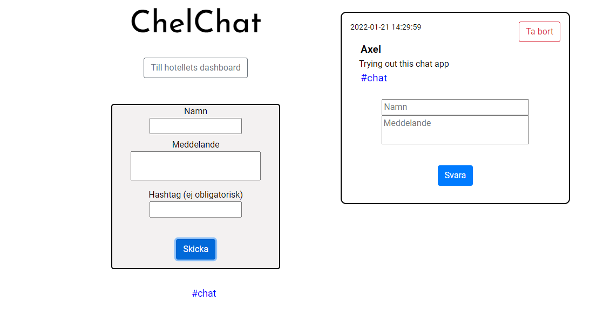

# ChelChat

## Twitter-style chat application built with .NET 5 and React. Real-time communication using SignalR.

## 1. Background

Created during fall term 2021 as course assignment. Part of higher vocational education: Webbutvecklare .NET (Web Developer .NET), 2020-2022, Jönköping University, Sweden. Name of course: Webbapplikationer med realtidskommunikation (Web Applications with Real-Time Communication)

Originally used together with a dashboard developed as part of a group project. The link to the dashboard is still there, but I have removed the code.

## 2. Requirements

### 2.1 Functional requirements

* As a user, you should be able to leave messages that can be read by others who use the application at the same time.
* Communication must take place via text in a chat room.
* The application must have a graphical client interface.
* The interface must be updated in real time.
* In the interface, a user should be able to input their name so that it is possible to determine who has written which message.
* Users should be able to respond to text messages sent by other users.
* Users should be able to "tag" text messages sent by other users.
* As a user, you should be able to access the application via both personal computer and tablet.
* The application should be accessible via hyperlink from the interface for monitoring a hotel's digital sensors. (removed in public version)

### 2.2 Technical requirements

* The application will be implemented as a server-side API in the ASP .NET Core framework.
* SignalR will be used for real-time communication between the client interface and the server-side API.

## 3. Technologies/techniques used

* .NET 5 (backend)
* React with Hooks (frontend)
* SignalR (real-time communication)

## 4. What I learned

I learned how to use, or increased my understanding of, the technologies and concepts listed above.
